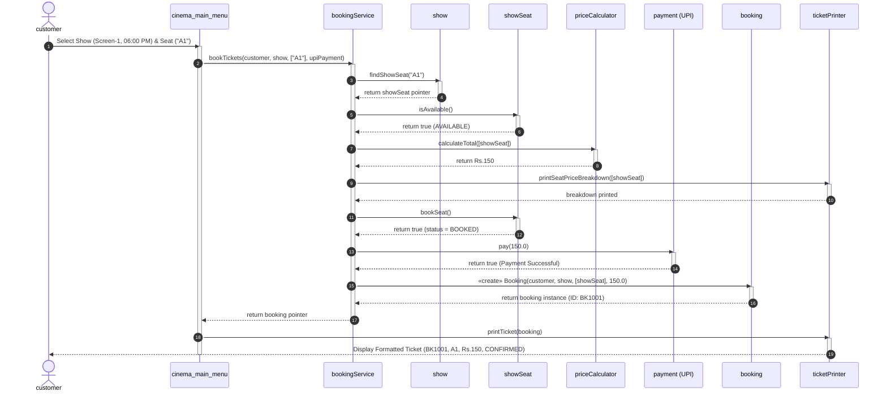

# TCS-504: System Design — Assignment 1
## Movie Ticket Booking System (Single Cinema)

**Author:** Dibyanshu Negi  
**Course & Branch:** B.Tech. Computer Science & Engineering (CSE)  
**Semester:** 5th Semester  
**Subject:** System Design  
**Subject Code:** TCS-504  
**Submission Date:** 07-September-2026  

---

# Table of Contents
1. [Executive Summary & Problem Scope](#1-executive-summary--problem-scope)
2. [Step A — Requirement Analysis (FR + NFR)](#2-step-a--requirement-analysis-fr--nfr)
3. [Step B — Noun–Verb Analysis Table](#3-step-b--nounverb-analysis-table)
4. [Step C — Class Responsibilities & Specifications](#4-step-c--class-responsibilities--specifications)
5. [Step D — Relationships & Lifetime Test](#5-step-d--relationships--lifetime-test)
6. [Step E — UML Class Diagram](#6-step-e--uml-class-diagram)
7. [Step F — UML Sequence Diagram](#7-step-f--uml-sequence-diagram)
8. [Step G — SOLID Principles & Intentional Design Non-Goals](#8-step-g--solid-principles--intentional-design-non-goals)
9. [Step H — OOP Concepts Mapping & Clean Code Checklist](#9-step-h--oop-concepts-mapping--clean-code-checklist)
10. [Step I — Verification & Demo Run Output](#10-step-i--verification--demo-run-output)

---

# 1. Executive Summary & Problem Scope

This document presents the complete Object-Oriented System Design and modular C++ implementation for a menu-driven movie ticket booking system for a single cinema (e.g., PVR or INOX).

### Scope — 8 Core Mandatory Features Implemented:
1. **F1:** List all movies currently playing.
2. **F2:** For a chosen movie, list its shows (screen name + start time).
3. **F3:** For a chosen show, display the physical seat layout with `AVAILABLE [ ]` / `BOOKED [X]` status.
4. **F4:** Book one or more seats for a show (reject whole booking if any requested seat is already booked or invalid).
5. **F5:** Dynamic pricing by seat category: **SILVER ₹150**, **GOLD ₹250**, **PLATINUM ₹400**.
6. **F6:** Payment processing via **UPI**, **Card**, or **Cash** (failed payment aborts booking and immediately releases seats).
7. **F7:** Print formatted ticket: Booking ID, Movie, Screen, Start Time, Seat Numbers, Total Amount, Status.
8. **F8:** Cancel a confirmed booking (reverts seat states back to `AVAILABLE`).
9. **Bonus Extension (F9):** Polymorphic Seat Tier Inspector — Detailed seat metrics for **Silver**, **Gold**, and **Platinum** (Total Seats, Reserved/Booked Seats list, Remaining/Free Seats list, and Tier Price).

---

# 2. Step A — Requirement Analysis (FR + NFR)

### Functional Requirements (FR)

* **FR1 — Movie Listing:** The system shall display a list of all movies currently playing in the cinema, showing movie title, language, and runtime duration in minutes.
* **FR2 — Show Scheduling:** For any user-selected movie, the system shall list all scheduled shows with their auditorium screen name/number and show start time.
* **FR3 — Seat Layout Display:** For any chosen show, the system shall display the auditorium seat layout categorized by tiers (`SILVER`, `GOLD`, `PLATINUM`), clearly marking each seat with its identifier and availability status (`[ ]` for Available, `[X]` for Booked).
* **FR4 — Booking (Standard):** A customer selects one or more seat numbers for a show. If *any* selected seat is already `BOOKED` or does not exist, the whole booking is rejected and no seat changes state. Booking is confirmed *only after* payment succeeds.
* **FR5 — Seat Tier Pricing:** The system shall calculate the total booking cost by summing individual seat prices based on their tier: `SILVER = ₹150`, `GOLD = ₹250`, `PLATINUM = ₹400`.
* **FR6 — Payment (Standard):** Exactly one method (`UPI` / `Card` / `Cash`) per booking. If payment fails, seats are released and booking status becomes `FAILED`.
* **FR7 — Ticket Generation:** Upon successful payment, the system shall format and print an itemized ticket containing: unique Booking ID, Movie Title, Screen Name, Start Time, List of Booked Seats, Total Amount, and Status (`CONFIRMED`).
* **FR8 — Booking Cancellation:** A customer can cancel a confirmed booking by supplying the Booking ID. Upon cancellation, the booking status is set to `CANCELLED` and all associated seats are immediately restored to `AVAILABLE`.
* **FR9 — Seat Tier Inspection:** The system shall allow inspecting any specific tier (`SILVER`, `GOLD`, `PLATINUM`) to inspect real-time metrics: Tier Price, Total Seats, Booked Seat IDs, and Available Seat IDs.

### Non-Functional Requirements (NFR)

* **NFR1 — Modularity & High Cohesion:** The system follows strict modular separation ("one class per file", no external header files), separating core domain entities from presentation and orchestration services.
* **NFR2 — Extensibility (Open-Closed Principle):** The payment subsystem and category inspector must allow introducing new payment gateways (e.g., `NetBankingPayment`) or new seat tiers (e.g., `ReclinerSeatCategory`) simply by subclassing abstract interfaces without modifying existing orchestrator code.
* **NFR3 — Robustness & Input Validation:** The system must gracefully handle invalid inputs (e.g., non-existent seat IDs like `Z9`, letters in numerical menus, out-of-bounds choices) by presenting clear user feedback without crashing or terminating.
* **NFR4 — Transactional Consistency & Atomic Rollback:** Seat reservation operations must be atomic. If payment fails or an exception occurs during the transaction, temporary seat locks are rolled back immediately, preventing phantom reservations.

---

# 3. Step B — Noun–Verb Analysis Table

### Noun Analysis Table (Keep vs. Reject)

| Noun Found in Problem | Keep as a Class? | Design Rationale & Justification |
| :--- | :---: | :--- |
| **Movie** | **Yes** | Core entity holding domain data (title, language, duration) and identity. |
| **Seat** | **Yes** | Represents a physical chair in an auditorium with fixed number and seat tier. |
| **ShowSeat** | **Yes** | **Crucial design separation:** Represents dynamic availability status of a seat for a specific show screening. |
| **Screen** | **Yes** | Auditorium entity that contains and owns physical `Seat` objects. |
| **Cinema** | **Yes** | Top-level theatre entity that owns auditorium screens. |
| **Show** | **Yes** | Screening entity binding a `Movie`, `Screen`, and `StartTime`, owning `ShowSeat` state instances. |
| **Customer** | **Yes** | Core actor entity holding customer identity (name, phone number). |
| **Booking** | **Yes** | Transactional record encapsulating booking ID, selected seats, total amount, and status. |
| **Payment** | **Yes** | Abstract strategy defining the payment contract for runtime polymorphism. |
| **UpiPayment / CardPayment / CashPayment** | **Yes** | Concrete payment strategy implementations inheriting from `Payment`. |
| **PriceCalculator** | **Yes** | Pure domain calculation service dedicated solely to computing totals from seat lists. |
| **TicketPrinter** | **Yes** | Pure presentation service responsible solely for console formatting and ticket rendering. |
| **BookingService** | **Yes** | Domain orchestrator managing end-to-end booking workflows, validation, and rollback. |
| **SeatCategory** | **Yes** | Abstract base class defining category-specific seat inspection and statistics. |
| *seat layout* | **No** | Not an independent entity; it is a visual presentation view of a Show's seats $\rightarrow$ method in `TicketPrinter`. |
| *console program / menu* | **No** | Execution entry point / UI loop $\rightarrow$ handled in `main.cpp`. |

### Verb Analysis Table (Verbs to Methods Mapping)

| Verb in Problem Statement | Associated Class | Method Name & Responsibility |
| :--- | :--- | :--- |
| "see movies playing" | `Cinema` / `Movie` | `getMovies()`, `getTitle()`, `getLanguage()` |
| "pick a show" | `Show` | `getStartTime()`, `getScreen()`, `getMovie()` |
| "see seats free / booked" | `TicketPrinter` / `ShowSeat` | `TicketPrinter::printSeatLayout()`, `ShowSeat::isAvailable()` |
| "book seats" | `BookingService` / `Show` | `BookingService::bookTickets()`, `ShowSeat::bookSeat()` |
| "price the booking" | `PriceCalculator` | `PriceCalculator::calculateTotal()` |
| "pay by UPI/Card/Cash" | `Payment` | `Payment::pay(double amount)` |
| "get / print a ticket" | `TicketPrinter` | `TicketPrinter::printTicket(Booking)` |
| "cancel a booking" | `BookingService` / `ShowSeat` | `BookingService::cancelBooking()`, `ShowSeat::releaseSeat()` |

---

# 4. Step C — Class Responsibilities & Specifications

### Summary Table of All Classes

| Class | Access | Data Members (State) | Member Methods (Behaviors) | What it MUST NOT do |
| :--- | :--- | :--- | :--- | :--- |
| **`Movie`** | Private | `title: string`<br>`language: string`<br>`durationMinutes: int` | `getTitle()`, `getLanguage()`, `getDurationMinutes()` | Must NOT know about screens, shows, or ticket pricing. |
| **`Seat`** | Private | `seatNumber: string`<br>`seatType: SeatType` | `getSeatNumber()`, `getSeatType()`, `getTypeName()` | Must NOT track booking status or show screening times. |
| **`Screen`** | Private | `screenNumber: int`<br>`screenName: string`<br>`seats: vector<Seat>` | `addSeat()`, `getSeats()`, `getScreenNumber()`, `getScreenName()` | Must NOT manage show scheduling or payment transactions. |
| **`Cinema`** | Private | `name: string`<br>`screens: vector<Screen>` | `addScreen()`, `getScreens()`, `getScreen()`, `getName()` | Must NOT process ticket bookings or print console tickets. |
| **`Show`** | Private | `showId: int`<br>`startTime: string`<br>`movie: const Movie*`<br>`screen: const Screen*`<br>`showSeats: vector<ShowSeat>` | `findShowSeat()`, `isSeatAvailable()`, `bookSeat()`, `releaseSeat()`, `getMovie()`, `getScreen()` | Must NOT calculate financial totals or process payments. |
| **`ShowSeat`** | Private | `physicalSeat: const Seat*`<br>`seatStatus: SeatStatus` | `isAvailable()`, `bookSeat()`, `releaseSeat()`, `getStatus()`, `getSeatNumber()`, `getSeatType()` | Must NOT create physical chairs or handle customer profiles. |
| **`Customer`** | Private | `name: string`<br>`phone: string` | `getName()`, `getPhone()` | Must NOT directly mutate seat statuses or screen data. |
| **`Booking`** | Private | `bookingId: string`<br>`customer: const Customer*`<br>`show: const Show*`<br>`bookedSeats: vector<ShowSeat*>`<br>`totalAmount: double`<br>`status: BookingStatus`<br>`static nextBookingId: int` | `markConfirmed()`, `markFailed()`, `markCancelled()`, `getBookingId()`, `getTotalAmount()`, `getStatus()` | Must NOT print formatted ticket output or process card payments. |
| **`Payment`** *(abstract)* | Protected/Public | *(Pure Interface)* | `pay(double amount) = 0`<br>`getPaymentMethodName() = 0` | Must NOT store booking histories or manipulate seat states. |
| **`UpiPayment`** | Private | `upiId: string`<br>`shouldSucceed: bool` | `pay(double amount)`, `getPaymentMethodName()` | Must NOT know about card numbers or cash change. |
| **`CardPayment`** | Private | `cardNumber: string`<br>`shouldSucceed: bool` | `pay(double amount)`, `getPaymentMethodName()` | Must NOT handle UPI virtual payment addresses. |
| **`CashPayment`** | Private | `shouldSucceed: bool` | `pay(double amount)`, `getPaymentMethodName()` | Must NOT interface with electronic payment gateways. |
| **`PriceCalculator`** | Public | `static constexpr SILVER_PRICE`<br>`static constexpr GOLD_PRICE`<br>`static constexpr PLATINUM_PRICE` | `getPriceForSeatType()`, `calculateTotal(seats)`, `calculateTotal(type, qty)` | Must NOT modify seat availability or generate tickets. |
| **`TicketPrinter`** | Public | *(Pure Utility / View)* | `printTicket(Booking)`, `printSeatLayout(Show)`, `printSeatPriceBreakdown(seats)` | Must NOT mutate business state or execute payments. |
| **`BookingService`** | Private | `bookings: vector<Booking>` | `bookTickets(customer, show, seats, payment)`, `cancelBooking(id)`, `findBooking(id)` | Must NOT format console ASCII art or hardcode payment types. |

---

### Architectural Design Decision: Why `ShowSeat` and NOT Just `Seat`?

> [!IMPORTANT]
> **Why separate `ShowSeat` from `Seat`?**
> Physical seat `A1` exists exactly once in an auditorium screen (`Screen-1`). However, its availability status changes for every scheduled show screening:
> - `A1` may be **BOOKED** for the 06:00 PM show.
> - `A1` may be **AVAILABLE** for the 09:00 PM show on the same date.
>
> If `status` were stored inside `Seat`, booking `A1` for one show would incorrectly lock `A1` across all shows across all time slots. 
> Therefore, `Seat` represents the immutable physical chair (number and tier), while `ShowSeat` represents the temporal availability status of that chair for one specific screening (`Show`).

---

# 5. Step D — Relationships & Lifetime Test

### Comprehensive Lifetime Test Analysis for All 10 Pairs

The **Lifetime Test** rule states: *"If the whole is destroyed, does the part die?"*

| Pair | UML Relationship | Lifetime Test Result & Architectural Justification |
| :--- | :---: | :--- |
| **Cinema — Screen** | **Composition (`◆`)** | **YES, the part dies.** A `Screen` auditorium is an integral structural component of a `Cinema`. If the cinema is destroyed or decommissioned, all its auditoriums cease to exist. |
| **Screen — Seat** | **Composition (`◆`)** | **YES, the part dies.** Physical `Seat` chairs are permanently bolted to the auditorium floor of a specific `Screen`. If the screen auditorium is demolished, the seats in that screen die with it. |
| **Show — Movie** | **Aggregation (`◇`)** | **NO, the part lives.** A `Show` borrows a `Movie` from the cinema's catalog. If the 6:00 PM show is cancelled or deleted, the movie *"3 Idiots"* still exists and continues playing in other scheduled shows. |
| **Show — Screen** | **Aggregation (`◇`)** | **NO, the part lives.** A `Show` takes place inside a `Screen`. When a show screening ends or is deleted, the physical auditorium remains completely intact. |
| **Show — ShowSeat** | **Composition (`◆`)** | **YES, the part dies.** `ShowSeat` represents the per-screening availability of seats for that exact showtime. If the `Show` screening is deleted, its per-show seat statuses are deleted with it. |
| **Booking — Customer** | **Aggregation (`◇`)** | **NO, the part lives.** A `Booking` record references the `Customer` who placed the order. If a booking is deleted or cancelled, the customer's identity record remains unaffected. |
| **Booking — ShowSeat** | **Aggregation (`◇`)** | **NO, the part lives.** A `Booking` references the `ShowSeat` objects it has reserved. When a booking is cancelled or removed, the `ShowSeat` objects still reside in the `Show` (reverting to `AVAILABLE`). |
| **Booking — Payment** | **Association (`──▶`)** | **NO, independent lifeline.** `Booking` delegates payment authorization to a `Payment` object during the checkout flow, but does not own or destroy the payment processor instance. |
| **Payment — UpiPayment** | **Inheritance (`──▷`)** | **Is-A Relationship.** `UpiPayment` is a concrete subtype implementing the abstract `Payment` interface via runtime polymorphism. |
| **BookingService — Booking** | **Aggregation (`◇`)** | **NO, records can persist independently.** `BookingService` orchestrates and manages a collection of `Booking` entities in its history store. |

---

# 6. Step E — UML Class Diagram

```mermaid
classDiagram
    direction TB

    class Cinema {
        -name: string
        -screens: vector~Screen~
        +Cinema(name: string)
        +addScreen(screen: Screen): void
        +getScreens(): vector~Screen~
        +getScreen(screenNumber: int): Screen*
        +getName(): string
    }

    class Screen {
        -screenNumber: int
        -screenName: string
        -seats: vector~Seat~
        +Screen(number: int, name: string)
        +addSeat(seatNumber: string, type: SeatType): void
        +reserveSeats(capacity: size_t): void
        +getSeats(): vector~Seat~
        +getScreenNumber(): int
        +getScreenName(): string
        +getTotalSeats(): int
    }

    class Seat {
        -seatNumber: string
        -seatType: SeatType
        +Seat(number: string, type: SeatType)
        +getSeatNumber(): string
        +getSeatType(): SeatType
        +getTypeName(): char*
    }

    class Movie {
        -title: string
        -language: string
        -durationMinutes: int
        +Movie(title: string, lang: string, duration: int)
        +getTitle(): string
        +getLanguage(): string
        +getDurationMinutes(): int
    }

    class Show {
        -showId: int
        -startTime: string
        -movie: Movie*
        -screen: Screen*
        -showSeats: vector~ShowSeat~
        +Show(id: int, movie: Movie*, screen: Screen*, time: string)
        +findShowSeat(seatNumber: string): ShowSeat*
        +isSeatAvailable(seatNumber: string): bool
        +bookSeat(seatNumber: string): bool
        +releaseSeat(seatNumber: string): void
        +getMovie(): Movie*
        +getScreen(): Screen*
        +getStartTime(): string
        +getShowSeats(): vector~ShowSeat~
    }

    class ShowSeat {
        -physicalSeat: Seat*
        -seatStatus: SeatStatus
        +ShowSeat(seat: Seat*)
        +isAvailable(): bool
        +bookSeat(): bool
        +releaseSeat(): void
        +getStatus(): SeatStatus
        +getSeatNumber(): string
        +getSeatType(): SeatType
        +getTypeName(): char*
        +getPhysicalSeat(): Seat*
    }

    class Customer {
        -name: string
        -phone: string
        +Customer(name: string, phone: string)
        +getName(): string
        +getPhone(): string
    }

    class Booking {
        -bookingId: string
        -customer: Customer*
        -show: Show*
        -bookedSeats: vector~ShowSeat*~
        -totalAmount: double
        -status: BookingStatus
        -nextBookingId: int$
        +Booking(customer: Customer*, show: Show*, seats: vector~ShowSeat*~, total: double)
        +markConfirmed(): void
        +markFailed(): void
        +markCancelled(): void
        +getBookingId(): string
        +getTotalAmount(): double
        +getStatus(): BookingStatus
        +getStatusName(): char*
        +getBookedSeats(): vector~ShowSeat*~
        +getShow(): Show*
        +getCustomer(): Customer*
    }

    class Payment {
        <<abstract>>
        +pay(amount: double)* bool
        +getPaymentMethodName()* char*
        +~Payment()
    }

    class UpiPayment {
        -upiId: string
        -shouldSucceed: bool
        +UpiPayment(upiId: string, shouldSucceed: bool)
        +pay(amount: double): bool
        +getPaymentMethodName(): char*
    }

    class CardPayment {
        -cardNumber: string
        -shouldSucceed: bool
        +CardPayment(cardNumber: string, shouldSucceed: bool)
        +pay(amount: double): bool
        +getPaymentMethodName(): char*
    }

    class CashPayment {
        -shouldSucceed: bool
        +CashPayment(shouldSucceed: bool)
        +pay(amount: double): bool
        +getPaymentMethodName(): char*
    }

    class PriceCalculator {
        +SILVER_PRICE: double$
        +GOLD_PRICE: double$
        +PLATINUM_PRICE: double$
        +getPriceForSeatType(type: SeatType)$ double
        +calculateTotal(seats: vector~ShowSeat*~)$ double
        +calculateTotal(type: SeatType, quantity: int)$ double
    }

    class TicketPrinter {
        +printTicket(booking: Booking)$ void
        +printSeatLayout(show: Show)$ void
        +printSeatPriceBreakdown(seats: vector~ShowSeat*~)$ void
        -printCategoryRow(label: char*, seats: vector~ShowSeat*~)$ void
    }

    class BookingService {
        -bookings: vector~Booking~
        -validateSeats(show: Show*, seats: vector~string~, outSeats: vector~ShowSeat*~): bool
        -lockSeats(seats: vector~ShowSeat*~): void
        -rollbackSeats(seats: vector~ShowSeat*~): void
        +bookTickets(customer: Customer*, show: Show*, seats: vector~string~, payment: Payment*): Booking*
        +cancelBooking(bookingId: string): bool
        +findBooking(bookingId: string): Booking*
        +getAllBookings(): vector~Booking~
    }

    class SeatCategory {
        <<abstract>>
        +getSeatType()* SeatType
        +getTierName()* char*
        +getPricePerSeat()* double
        +calculateStats(show: Show)* CategoryStats
        +printDetailedStats(show: Show)* void
        +~SeatCategory()
    }

    class SilverSeatCategory {
        +calculateStats(show: Show): CategoryStats
        +printDetailedStats(show: Show): void
    }

    class GoldSeatCategory {
        +calculateStats(show: Show): CategoryStats
        +printDetailedStats(show: Show): void
    }

    class PlatinumSeatCategory {
        +calculateStats(show: Show): CategoryStats
        +printDetailedStats(show: Show): void
    }

    %% Relationships and Multiplicities
    Cinema "1" *-- "1..*" Screen : owns
    Screen "1" *-- "1..*" Seat : owns
    Show "1" o-- "1" Movie : references
    Show "1" o-- "1" Screen : screened in
    Show "1" *-- "1..*" ShowSeat : owns per show
    ShowSeat "1" o-- "1" Seat : references
    Booking "1" o-- "1" Customer : placed by
    Booking "1" o-- "1" Show : for show
    Booking "1" o-- "1..*" ShowSeat : reserves
    BookingService "1" o-- "*" Booking : manages
    BookingService ..> Payment : uses (DIP)
    BookingService ..> PriceCalculator : uses
    BookingService ..> TicketPrinter : uses

    Payment <|-- UpiPayment : inheritance
    Payment <|-- CardPayment : inheritance
    Payment <|-- CashPayment : inheritance

    SeatCategory <|-- SilverSeatCategory : inheritance
    SeatCategory <|-- GoldSeatCategory : inheritance
    SeatCategory <|-- PlatinumSeatCategory : inheritance
```



---

# 7. Step F — UML Sequence Diagram

### Use Case: "Customer books 1 seat and pays by UPI"



---

# 8. Step G — SOLID Principles & Intentional Design Non-Goals

### SOLID Principles Applied

| Principle | Description & How Applied in Codebase | Concrete Location |
| :--- | :--- | :--- |
| **S — Single Responsibility Principle** | Every class has one single reason to change: `PriceCalculator` only computes monetary totals; `TicketPrinter` only formats strings/console output; `Booking` only holds transaction records; `BookingService` only orchestrates business workflows. | [`11_PriceCalculator.cpp`](file:///c:/Users/Admin/OneDrive/PROJECTS/System_design_Assignment1/11_PriceCalculator.cpp), [`12_TicketPrinter.cpp`](file:///c:/Users/Admin/OneDrive/PROJECTS/System_design_Assignment1/12_TicketPrinter.cpp) |
| **O — Open/Closed Principle** | Open for extension, closed for modification. Adding a new payment method (e.g. `NetBankingPayment`) or new seat category (e.g. `ReclinerSeatCategory`) requires creating a new subclass without editing existing services. | [`09_Payment.cpp`](file:///c:/Users/Admin/OneDrive/PROJECTS/System_design_Assignment1/09_Payment.cpp), [`14_SeatCategory.cpp`](file:///c:/Users/Admin/OneDrive/PROJECTS/System_design_Assignment1/14_SeatCategory.cpp) |
| **L — Liskov Substitution Principle** | Any derived class (`UpiPayment`, `CardPayment`, `CashPayment`) can be passed to any consumer expecting `Payment*` without unexpected side effects or special setup code. | [`10_PaymentTypes.cpp`](file:///c:/Users/Admin/OneDrive/PROJECTS/System_design_Assignment1/10_PaymentTypes.cpp) |
| **I — Interface Segregation Principle** | The `Payment` interface defines only essential payment capabilities (`pay()`, `getPaymentMethodName()`). It avoids polluting base contracts with non-universal operations like `refund()`. | [`09_Payment.cpp`](file:///c:/Users/Admin/OneDrive/PROJECTS/System_design_Assignment1/09_Payment.cpp) |
| **D — Dependency Inversion Principle** | High-level business orchestrator (`BookingService`) depends upon the abstract abstraction `Payment*`, not concrete payment classes (`UpiPayment`, `CardPayment`). | [`13_BookingService.cpp`](file:///c:/Users/Admin/OneDrive/PROJECTS/System_design_Assignment1/13_BookingService.cpp#L69-L75) |

---

### What Was Deliberately NOT Done (Design Non-Goals)

1. **Deliberately Did NOT Create a Separate `SeatLayout` Class:**
   - *Rationale:* A "seat layout" is not an independent domain entity with its own lifecycle or state; it is merely a visual presentation of a `Show`'s `ShowSeat` collection. Creating a `SeatLayout` class would introduce unnecessary boilerplate and violate High Cohesion. Instead, layout rendering is encapsulated as a pure presentation method in `TicketPrinter::printSeatLayout()`.
2. **Deliberately Did NOT Allow `Booking` to Own the `Payment` Object:**
   - *Rationale:* A booking record should store transaction metadata (amount, status, timestamp) rather than persisting the transient payment processor object. This prevents tight coupling and security leaks (e.g., holding customer payment credentials in storage).

---

# 9. Step H — OOP Concepts Mapping & Clean Code Checklist

### OOP Concepts Implemented & Code Locations

| OOP Concept | Requirement & Implementation | Code Location Reference |
| :--- | :--- | :--- |
| **1. Encapsulation** | All data members are strictly `private`. State mutations occur only via validated methods (e.g., `bookSeat()`, `releaseSeat()`, `markConfirmed()`). | [`06_ShowSeat.cpp:L24-L60`](file:///c:/Users/Admin/OneDrive/PROJECTS/System_design_Assignment1/06_ShowSeat.cpp#L24-L60), [`08_Booking.cpp:L29-L76`](file:///c:/Users/Admin/OneDrive/PROJECTS/System_design_Assignment1/08_Booking.cpp#L29-L76) |
| **2. Abstraction** | Abstract base classes with pure virtual methods: `Payment::pay()` and `SeatCategory::calculateStats()`. | [`09_Payment.cpp:L14-L22`](file:///c:/Users/Admin/OneDrive/PROJECTS/System_design_Assignment1/09_Payment.cpp#L14-L22), [`14_SeatCategory.cpp:L28-L38`](file:///c:/Users/Admin/OneDrive/PROJECTS/System_design_Assignment1/14_SeatCategory.cpp#L28-L38) |
| **3. Inheritance** | `UpiPayment`, `CardPayment`, `CashPayment` inherit from `Payment`; `Silver/Gold/PlatinumSeatCategory` inherit from `SeatCategory`. | [`10_PaymentTypes.cpp:L19`](file:///c:/Users/Admin/OneDrive/PROJECTS/System_design_Assignment1/10_PaymentTypes.cpp#L19), [`15_SeatCategoryTypes.cpp:L71`](file:///c:/Users/Admin/OneDrive/PROJECTS/System_design_Assignment1/15_SeatCategoryTypes.cpp#L71) |
| **4. Runtime Polymorphism** | Dynamic dispatch via base pointers: `payment->pay(total)` and `category->printDetailedStats(show)`. | [`13_BookingService.cpp:L91`](file:///c:/Users/Admin/OneDrive/PROJECTS/System_design_Assignment1/13_BookingService.cpp#L91), [`main.cpp:L209`](file:///c:/Users/Admin/OneDrive/PROJECTS/System_design_Assignment1/main.cpp#L209) |
| **5. Compile-Time Polymorphism** | Overloaded constructors in entity classes and overloaded calculation methods in `PriceCalculator`. | [`11_PriceCalculator.cpp:L33-L46`](file:///c:/Users/Admin/OneDrive/PROJECTS/System_design_Assignment1/11_PriceCalculator.cpp#L33-L46) |
| **6. Static Members** | Class-level static counter `static int nextBookingId` generating unique IDs (`BK1001`, `BK1002`). | [`08_Booking.cpp:L30-L46`](file:///c:/Users/Admin/OneDrive/PROJECTS/System_design_Assignment1/08_Booking.cpp#L30-L46) |
| **7. `this` Keyword** | Used inside constructors and methods to disambiguate member fields from parameters and refer to the calling object. | [`01_Movie.cpp:L30-L32`](file:///c:/Users/Admin/OneDrive/PROJECTS/System_design_Assignment1/01_Movie.cpp#L30-L32), [`07_Customer.cpp:L29-L30`](file:///c:/Users/Admin/OneDrive/PROJECTS/System_design_Assignment1/07_Customer.cpp#L29-L30) |
| **8. Composition** | `Cinema` owns `Screen`; `Screen` owns `Seat`; `Show` owns `ShowSeat`. | [`03_Screen.cpp:L23`](file:///c:/Users/Admin/OneDrive/PROJECTS/System_design_Assignment1/03_Screen.cpp#L23), [`04_Cinema.cpp:L22`](file:///c:/Users/Admin/OneDrive/PROJECTS/System_design_Assignment1/04_Cinema.cpp#L22), [`05_Show.cpp:L33`](file:///c:/Users/Admin/OneDrive/PROJECTS/System_design_Assignment1/05_Show.cpp#L33) |
| **9. Aggregation** | `Show` references `Movie` & `Screen`; `Booking` references `Customer` & `ShowSeats`. | [`05_Show.cpp:L27-L30`](file:///c:/Users/Admin/OneDrive/PROJECTS/System_design_Assignment1/05_Show.cpp#L27-L30), [`08_Booking.cpp:L35-L37`](file:///c:/Users/Admin/OneDrive/PROJECTS/System_design_Assignment1/08_Booking.cpp#L35-L37) |
| **10. Association** | `Customer` interacts with `BookingService` to book tickets; neither owns the other. | [`13_BookingService.cpp:L69-L74`](file:///c:/Users/Admin/OneDrive/PROJECTS/System_design_Assignment1/13_BookingService.cpp#L69-L74) |

---

### Clean Code Checklist Verification

- [x] **Intention-revealing names:** Clear identifiers throughout (`isSeatAvailable`, `bookedSeats`, `calculateTotal`).
- [x] **No number-series names:** Meaningful domain variables used instead of `list1`, `temp1`.
- [x] **Single Responsibility functions:** Each function performs exactly one task.
- [x] **Functions under ~20 lines:** Small, focused functions.
- [x] **Max 2 levels of indentation:** Guard clauses and early returns applied throughout.
- [x] **0–2 parameters preferred:** Multi-parameter requirements bundled into cohesive structs/classes.
- [x] **No side effects in query methods:** `isSeatAvailable()` and `getSeats()` are `const` with zero side effects.
- [x] **Constants instead of magic numbers:** `SILVER_PRICE = 150.0`, `GOLD_PRICE = 250.0`, `PLATINUM_PRICE = 400.0`.
- [x] **DRY (Don't Repeat Yourself):** Shared logic centralized in helper namespaces and utilities.

---

# 10. Step I — Verification & Demo Run Output

### Automated Verification Test Suite Execution

```
======================================================
  RUNNING OPTIMIZED AUTOMATED VERIFICATION SUITE      
======================================================

----------------------------------------
Screen-1  06:00 PM |  3 Idiots
SILVER     A1[ ] A2[X] A3[ ] A4[ ] 
GOLD       B1[ ] B2[ ] B3[X] 
PLATINUM   C1[ ] C2[ ] 

( [ ] = available  [X] = booked )
----------------------------------------

[TEST: Polymorphic Tier Statistics Verification]

========================================
       SILVER   TIER SEAT DETAILS       
========================================
Price per Seat   : Rs.150
Total Seats      : 4
Reserved (Booked): 1 [A2]
Remaining (Free) : 3 [A1, A3, A4]
========================================

========================================
       GOLD     TIER SEAT DETAILS       
========================================
Price per Seat   : Rs.250
Total Seats      : 3
Reserved (Booked): 1 [B3]
Remaining (Free) : 2 [B1, B2]
========================================

========================================
       PLATINUM TIER SEAT DETAILS       
========================================
Price per Seat   : Rs.400
Total Seats      : 2
Reserved (Booked): 0 [None]
Remaining (Free) : 2 [C1, C2]
========================================

Selected Seats Breakdown:
  A1   SILVER    Rs.150
  B2   GOLD      Rs.250
  TOTAL     Rs.400

[UPI] Rs.400 paid successfully

================ TICKET ================
Booking ID : BK1001
Movie      : 3 Idiots
Screen     : Screen-1   06:00 PM
Seats      : A1, B2
Amount     : Rs.400     Status: CONFIRMED
========================================

>> TEST 1 PASSED: Confirmed ID BK1001
[Booking Rejected] Seat A1 is already BOOKED. No seats reserved.
>> TEST 2 PASSED: Double booking rejected; A3 remains AVAILABLE.

Selected Seats Breakdown:
  A3   SILVER    Rs.150
  TOTAL     Rs.150

[Card] Transaction FAILED: Insufficient balance / Card declined.
[Booking Failed] Payment was not successful. Seats have been released.
>> TEST 3 PASSED: Payment failure rolled back; A3 remains AVAILABLE.
[Success] Booking BK1001 has been cancelled. Seats are now AVAILABLE.
>> TEST 4 PASSED: Booking cancelled; seats A1 & B2 released.
[Booking Rejected] Seat Z9 does not exist.
>> TEST 5 PASSED: Invalid seat handled without crash.

======================================================
        ALL OPTIMIZED TESTS PASSED SUCCESSFULLY       
======================================================
```

### Edge Cases Handled Summary:
1. **Double-Booking Prevention:** Attempting to book an already-booked seat (`A1`) rejects the entire transaction and keeps other seats unaffected.
2. **Payment Failure Rollback:** If card payment is declined, temporary seat locks on `A3` are immediately rolled back to `AVAILABLE`.
3. **Cancellation & Seat Release:** Cancelling `BK1001` flips status to `CANCELLED` and releases `A1` and `B2` back to `AVAILABLE`.
4. **Invalid Seat Handling:** Requesting a non-existent seat `Z9` returns a clean error message with zero crashes.
5. **Polymorphic Tier Inspection:** Inspecting Silver, Gold, and Platinum calculates real-time counts and seat numbers cleanly.
